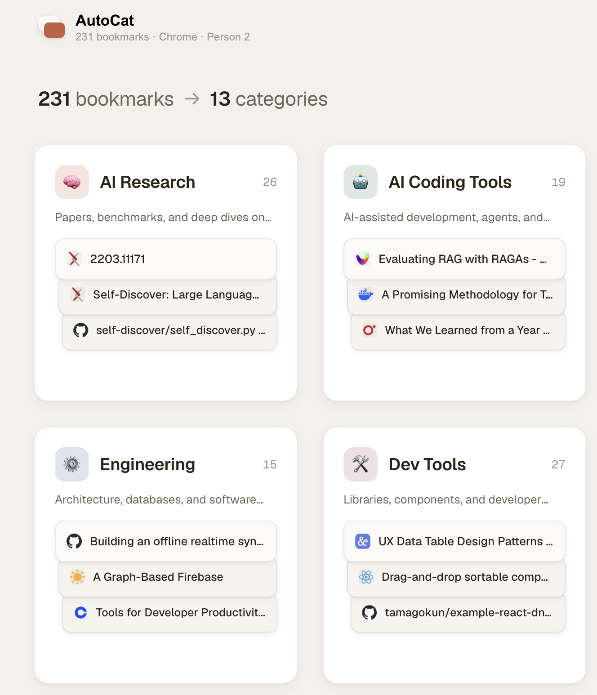
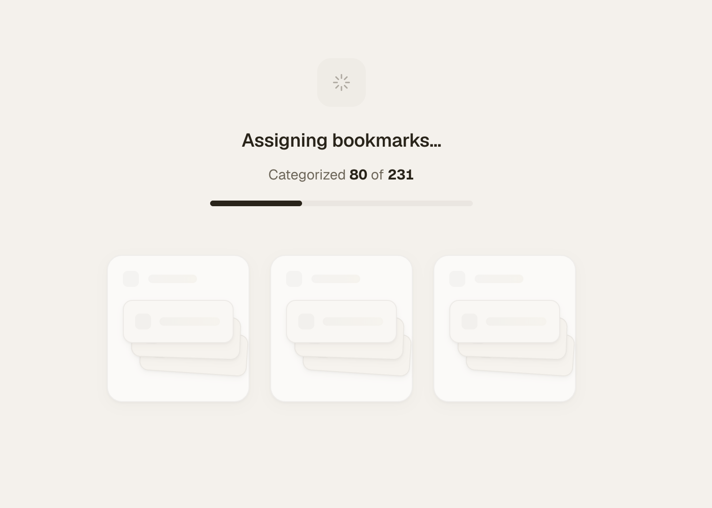
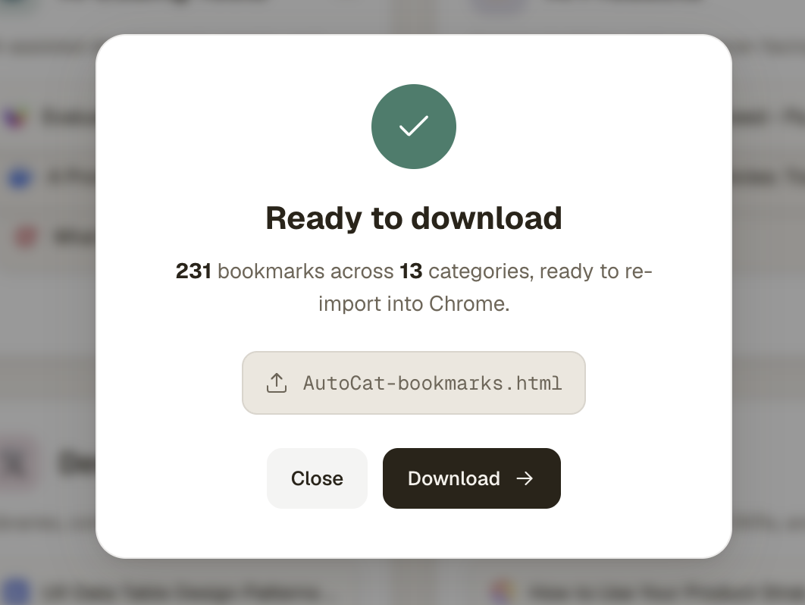

# AutoCat

A local web app that categorizes a messy folder of Chrome bookmarks using Claude.

Point it at a Chrome profile or drop in an exported `bookmarks.html`. AutoCat asks Claude to invent a sensible taxonomy, assigns every bookmark to a category, and exports a new `bookmarks.html` you can re-import into Chrome. No API key — it uses your local Claude Code install.



## Screenshots

| Categorizing | Export |
|---|---|
|  |  |

## Quick start

You need [Claude Code](https://claude.com/claude-code) installed and authenticated, and Node 20+.

```sh
git clone https://github.com/denny-codes/autocat.git
cd autocat
npm install
npm start
```

Open <http://localhost:3000>.

## How it works

1. **Setup** — checks that `claude --version` works.
2. **Source** — pick a Chrome profile + folders, or drop an exported `bookmarks.html`.
3. **Categorize** — two-pass call to Claude via the [Claude Agent SDK](https://www.npmjs.com/package/@anthropic-ai/claude-agent-sdk):
   - **Taxonomy pass:** Claude proposes 5–15 categories sized to the dataset.
   - **Assignment pass:** bookmarks are batched (~80 at a time) and each batch is assigned to the taxonomy.
4. **Review** — edit category names/summaries, move bookmarks between categories.
5. **Export** — download a new `bookmarks.html` to re-import via `chrome://bookmarks → ⋮ → Import bookmarks from HTML`.

## Where data lives

- `~/.autocat/config.json` (mode `0600`) — chosen model and last profile. The only thing AutoCat writes to disk.
- Browser `localStorage` — light/dark theme preference.
- Everything else (parsed bookmarks, categorization jobs, the categorized result) is in-memory and gone on restart/refresh.
- Chrome's `Bookmarks` file is read, never written.

## Stack

- Node 20+ / Express
- `@anthropic-ai/claude-agent-sdk` for LLM access (routes through your local Claude Code)
- `cheerio` for parsing Netscape bookmark HTML
- React 18 UMD + Babel-standalone in the browser (no build step)
- UI design via [Claude design](https://claude.ai/design); see [`DESIGN.md`](DESIGN.md)
